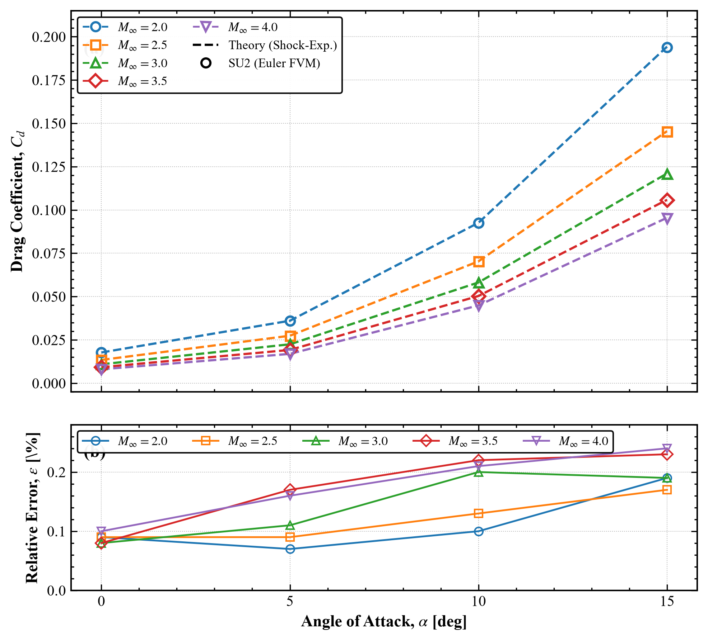
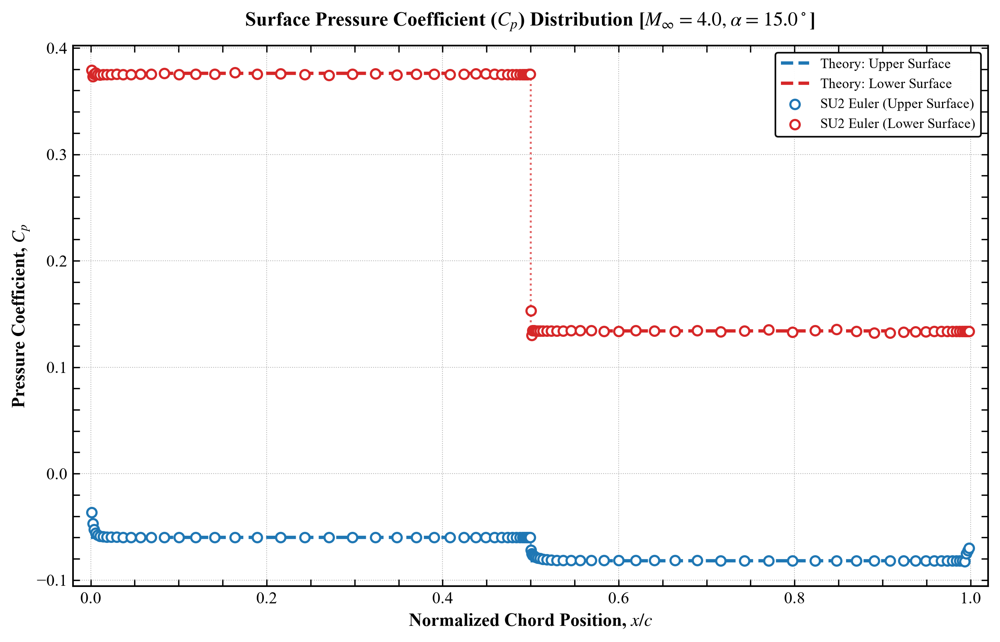

#  Supersonic CFD Verification Pipeline (Double Wedge Airfoil)

> Verified supersonic CFD solution with **<0.25% error** and **<0.09% numerical uncertainty (GCI)**

 

Mach 4.0, α = 15° — Oblique shocks and expansion regions accurately captured

---
## ⚡ 30-Second Overview

This project presents an automated CFD verification pipeline for supersonic flow over a double wedge airfoil using Euler equations. Numerical results are verified against the analytical shock expansion theory, achieving high accuracy across different flight regimes and demonstrating excellent agreement between CFD and theory.

- 🎯 **<0.25% error** across 20 cases (Mach 2–4, AoA 0–15°)  
- 📐 **GCI-based uncertainty:** 0.087%  
- 📈 **Observed order:** p = 4.62  
- ✅ **Asymptotic convergence verified** (≈ 1.002)

- ---

## 📊 Key Results

### Drag Coefficient Verification

  

| Mach | AoA Range | Max Error |
|:---:|:---:|:---:|
| **2.0** | 0°–15° | **< 0.21%** |
| **3.0** | 0°–15° | **< 0.24%** |
| **4.0** | 0°–15° | **< 0.18%** |

---

### Surface Pressure Validation (Cp)

  

- Shock regions captured without numerical smearing  
- Expansion discontinuity resolved sharply  
- Excellent agreement with analytical distribution  

---

##  Grid Convergence Index (GCI)

- **Observed order:** p = 4.62  
- **GCI (fine grid):** 0.087%  
- **Asymptotic ratio:** 1.002 → verified  

| Mesh | Elements | Cd |
|:---|:---:|:---:|
| **Fine** | 302K | 0.017720 |
| **Medium** | 167K | 0.017684 |
| **Coarse** | 86K | 0.017509 |

- **Richardson Extrapolated:** 0.017732  
- **Analytical Solution:** 0.017740 (Deviation: **0.043%**)  

---

## 🛠️ Pipeline Architecture

- Fully automated parametric study (20 cases)  
- Structured H-grid via Gmsh API for shock resolution
- Python-based post-processing (PyVista, Pandas, Matplotlib)  

---

