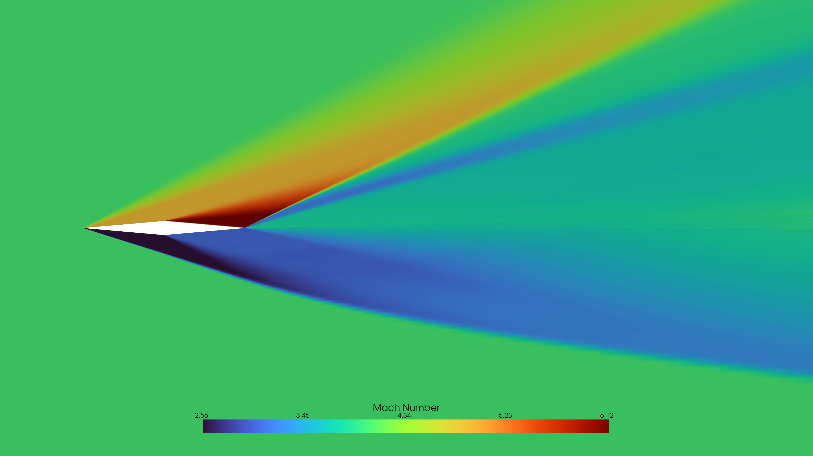

#  Supersonic CFD Verification Pipeline (Double Wedge Airfoil)

> Verified supersonic CFD solution with **<0.25% error** and **<0.09% numerical uncertainty (GCI)**

 

Mach 4.0, α = 15° — Oblique shocks and expansion regions accurately captured

---
