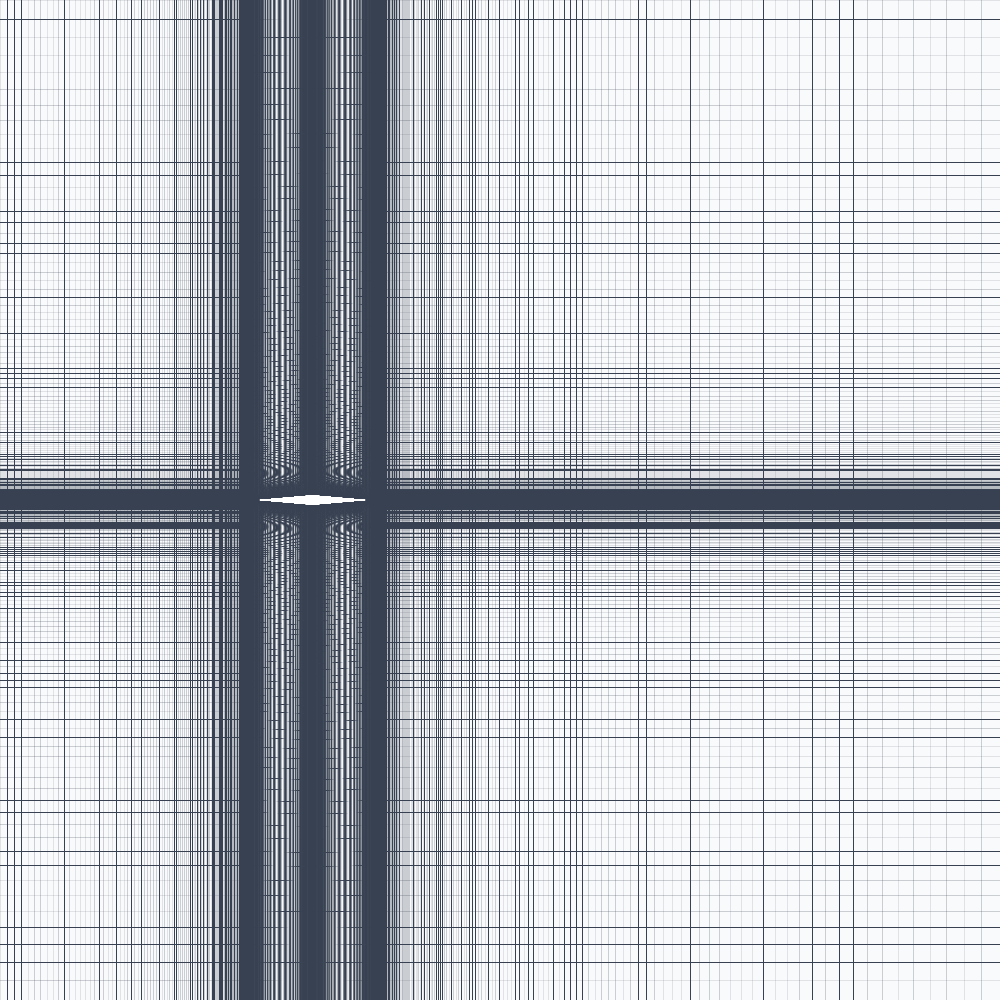
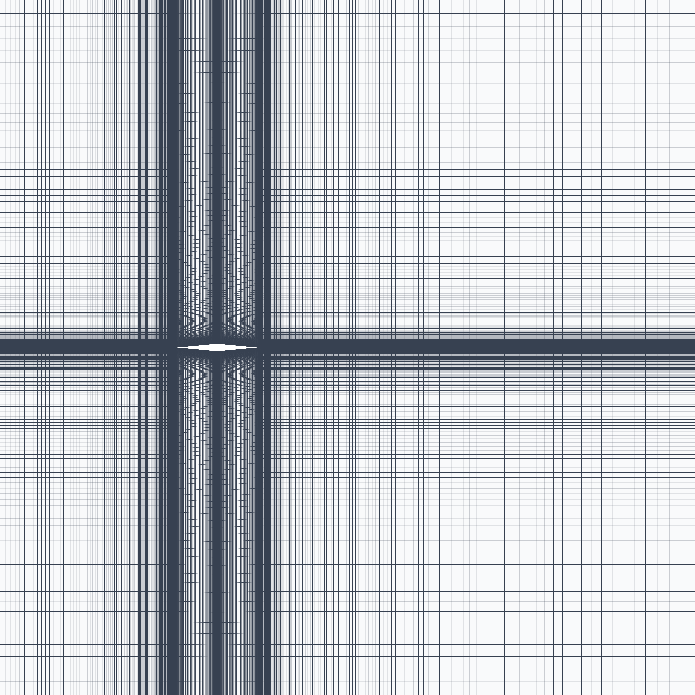
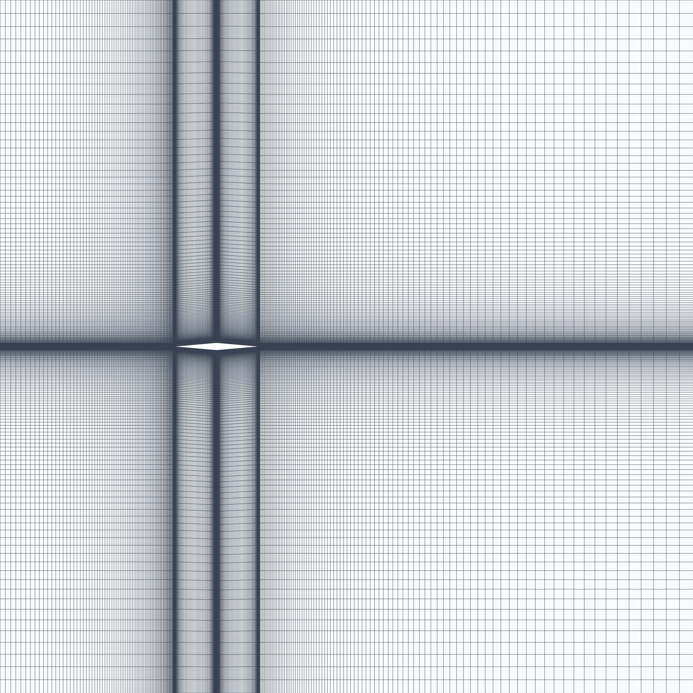

# Mesh Generation & Grid Convergence Index (GCI) Verification

## 1. Overview

This section presents the generation of structured H-grid meshes and the formal verification of spatial discretization errors using the ASME V&V 20 Grid Convergence Index (GCI) methodology. The objective is to demonstrate that the numerical solution lies within the asymptotic convergence range and is independent of grid resolution.

## 2. Domain & Boundary Conditions

A structured H-grid topology is employed to ensure alignment with shock waves and expansion fans, minimizing numerical dissipation and preserving discontinuities. The farfield boundaries are placed sufficiently far from the airfoil to eliminate boundary interference effects. Bump and progression parameters are applied in order to ensure that mesh is fine enough near the regions where shock waves and expansion fans are formed.

* **Airfoil:** Chord $c = 1.0\text{ m}$, thickness $t/c = 0.0875\%$ ($\theta =  5.0^\circ$)
* **Outer Boundaries (All):** `MARKER_FARFIELD`
* **Airfoil Surface:** `MARKER_EULER`

## 3. Mesh Visualizations

** Fine Mesh (302k Cells) **

** Medium Mesh (167k Cells) **

** Coarse Mesh (86k Cells) **

